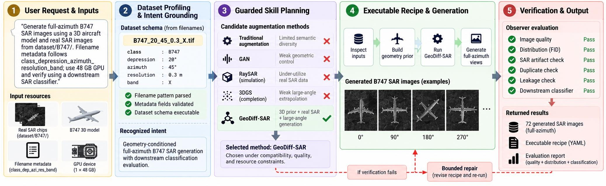
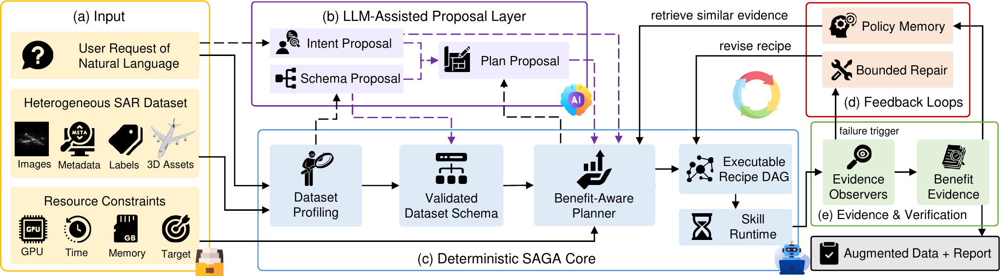
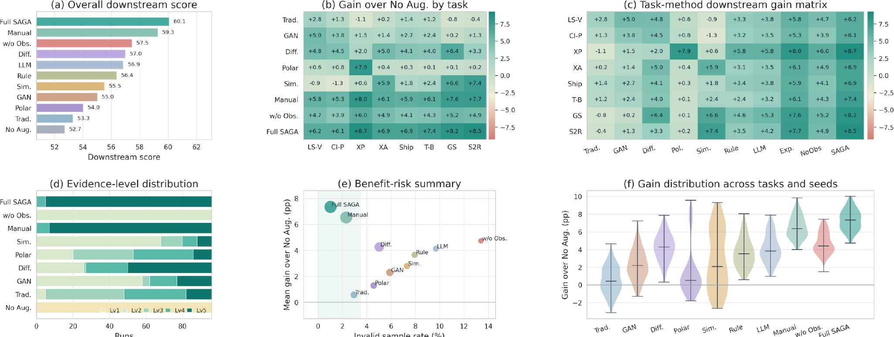
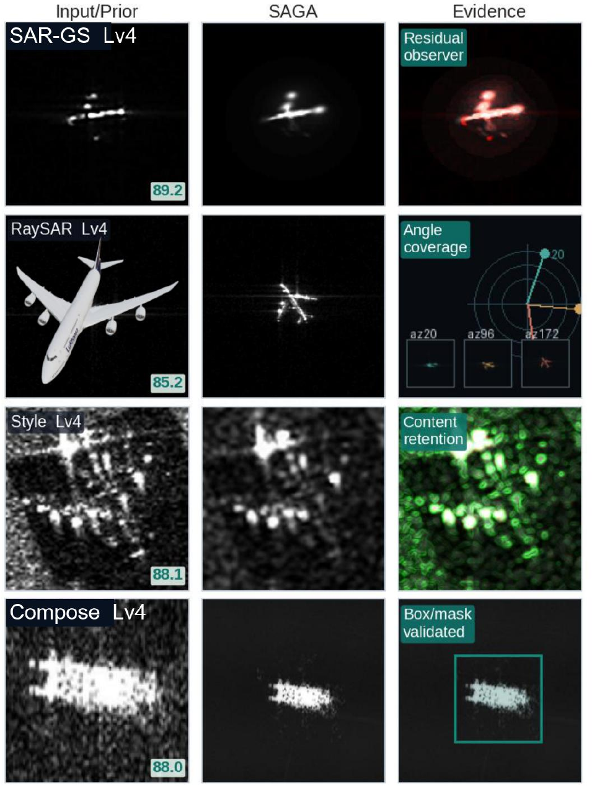

<div align="center">

# SAGA

### A Task-Driven and Quality-Assured Agent Framework for SAR Data Generation

[](https://github.com/wxt117/SAGA/actions/workflows/ci.yml)
[](pyproject.toml)
[](LICENSE)
[](#release-scope)

**Xuanting Wu, Fan Zhang, Fei Ma, Ling Guan, Guochun Ma, Yongsheng Zhou**

College of Information Science and Technology, Beijing University of Chemical Technology<br>
National Key Laboratory of Scattering and Radiation

[Overview](#overview) | [Installation](#installation) | [Quickstart](#quickstart) | [Results](#paper-results) | [Citation](#citation)

</div>

SAGA is a schema-grounded and evidence-aware agent for task-oriented synthetic aperture radar (SAR) data generation and augmentation. Given a natural-language request and heterogeneous SAR inputs, SAGA profiles the dataset, validates its schema, selects a feasible augmentation strategy, compiles an executable recipe, and verifies the resulting data.

> SAGA is not a single image generator. It is the decision and execution layer that connects SAR datasets, augmentation methods, resource constraints, and evaluation evidence in one auditable workflow.

<p align="center">
  
</p>

<p align="center"><sub><b>End-to-end SAGA workflow.</b> A full-azimuth B747 example covering schema grounding, guarded skill selection, generation, verification, and bounded repair (paper Fig. 2).</sub></p>

## Overview

SAR augmentation decisions depend on more than visual realism. Dataset layouts are often laboratory-specific; metadata such as class, azimuth, depression angle, resolution, band, and polarization may be encoded in paths, filenames, sidecars, or annotations. Generation methods also differ in applicability, computational cost, controllability, and failure modes.

SAGA addresses this as a dataset-conditioned decision problem:

1. **Ground the data.** Extract observable file, image, annotation, and metadata facts, then compile and validate an executable dataset schema.
2. **Plan under constraints.** Match the task, dataset deficits, hardware budget, and method requirements using compatibility guardrails and benefit-aware ranking.
3. **Execute auditable recipes.** Convert the selected plan into a deterministic recipe DAG with standardized provenance and skill reports.
4. **Verify before claiming benefit.** Evaluate quality, distribution, SAR artifacts, duplicates, leakage, and optional downstream utility.
5. **Repair and learn.** Apply bounded repair when verification fails and retain evidence for future planning.

The LLM-assisted layer is optional. LLMs may propose an intent, schema, or plan, but deterministic validators and guardrails decide whether those proposals are executable.

<p align="center">
  
</p>

<p align="center"><sub><b>Overall architecture.</b> Solid paths are deterministic execution and validated data flow; dashed paths are optional LLM-assisted proposals that must pass validation (paper Fig. 4).</sub></p>

## Key Features

| Capability | What SAGA provides |
| --- | --- |
| Schema-grounded profiling | Progressive discovery of heterogeneous SAR layouts, metadata coverage, labels, and format constraints |
| Guarded planning | Intent recognition, compatibility filtering, benefit-cost-risk ranking, and recipe verification |
| Recipe-centric execution | DAG execution, checkpoints, provenance, standardized reports, and dry-run inspection |
| SAR-aware verification | Quality, distribution, artifact, duplicate, leakage, and metadata-slice observers |
| Evidence qualification | Separation of generation success, evaluator evidence, and demonstrated downstream benefit |
| Bounded feedback | Parameter repair, recipe revision, run continuation, and policy memory |

## Installation

Python 3.10 or newer is required. The repository's server environment is named `sd3`:

```bash
git clone https://github.com/wxt117/SAGA.git
cd SAGA
conda env create -f environment.yml
conda activate sd3
python -m saga --help
```

If `sd3` already exists, update it instead:

```bash
conda env update -n sd3 -f environment.yml
conda activate sd3
```

Install development and plotting dependencies when running tests or paper experiment scripts:

```bash
python -m pip install -e ".[dev,plots]"
```

## Quickstart

The public demo is CPU-only and self-contained. It creates a small synthetic SAR-like fixture, profiles the format, applies deterministic SAR-aware augmentation, and evaluates the generated samples. No private dataset, model checkpoint, GPU, or API key is required.

```bash
# 1. Create 12 SAR-like chips with filename and sidecar metadata.
python examples/make_demo_dataset.py

# 2. Profile the dataset and ground a validated schema.
python -m saga profile-dataset \
  --root examples/demo_dataset \
  --request "augment the vehicle SAR chips while preserving polarization metadata" \
  --output outputs/demo/profile

python -m saga bridge-format \
  --profile outputs/demo/profile \
  --output outputs/demo/profile

# 3. Materialize 12 deterministic augmentations.
python -m saga traditional-augment \
  --dataset examples/demo_dataset \
  --output outputs/demo/augmentation \
  --target-count 12 \
  --run

# 4. Run the quality observer.
python -m saga evaluate-output \
  --input outputs/demo/augmentation/generated_images \
  --output outputs/demo/evaluation \
  --expected-count 12
```

To exercise the end-to-end agent from one request, run:

```bash
python -m saga agent-run \
  --request "use traditional SAR augmentation on examples/demo_dataset and generate 12 samples" \
  --dataset-root examples/demo_dataset \
  --output outputs/demo/agent \
  --no-memory
```

`agent-run` and computationally expensive skills default to dry-run. Add `--run` only after inspecting the selected recipe, parameters, and backend paths.

### Optional LLM assistance

The deterministic workflow does not require an LLM. To enable LLM-assisted intent parsing or planning, supply the credential through the environment rather than a YAML file:

```bash
export DEEPSEEK_API_KEY="your-api-key"

python -m saga agent-run \
  --request "profile my SAR dataset and propose a feasible augmentation recipe" \
  --dataset-root /path/to/dataset \
  --output outputs/llm-plan \
  --llm-config configs/llm/deepseek_v4pro.yaml \
  --use-llm-intent \
  --use-llm-planner
```

Never commit credentials to a configuration file.

## Skills and Backends

The release includes a deterministic framework and local skills, plus adapters for specialized research backends.

| Category | Included capabilities | Availability |
| --- | --- | --- |
| Data understanding | Profiling, format inspection, schema bridging, validation, metadata captions | Runs from this repository |
| Local augmentation | Traditional SAR augmentation, preprocessing, pseudocolor, target-background composition | Runs from this repository |
| Evaluation | Quality, distribution, SAR artifacts, duplicates, leakage, metadata slices | Runs from this repository |
| Agent runtime | Intent routing, planning, recipe DAGs, execution, repair, memory, reporting | Runs from this repository |
| Learned generation | GAN, diffusion LoRA, style transfer, GeoDiff-SAR, background generation | Adapter; external code/weights required |
| Physics and 3D | RaySAR, view sweeps, model-to-POV conversion, Gaussian splatting | Adapter; external tools/assets required |
| Downstream evaluation | Classification workflow and standardized evidence reports | Adapter; evaluator project/data required |

Backend configuration examples live in [`configs/skills/`](configs/skills/). External projects, checkpoints, datasets, and CUDA environments are not vendored and remain subject to their own licenses. See the [skill catalog](docs/skill_catalog.md) for inputs, limitations, and command examples.

## Paper Results

The manuscript evaluates SAGA on schema grounding, intent and skill planning, recipe execution, failure detection and repair, downstream augmentation utility, and component ablations.

Across the reported benchmark of **8 SAR task groups x 12 seeds**, Full SAGA achieved:

| Metric | Full SAGA | Interpretation |
| --- | ---: | --- |
| Aggregate downstream score | **60.1 +/- 4.5** | Equal-weight macro-average of task-appropriate Accuracy, macro-F1, or mAP |
| Matched gain over no augmentation | **+7.4 +/- 1.2 pp** | Improvement over the matched no-augmentation baseline |
| Invalid-sample rate | **1.0%** | Generated samples rejected as invalid |
| Evidence-qualified improvement rate (Lv5) | **94.8%** | Runs supported by downstream evaluation evidence |

These values combine task-appropriate metrics and should not be interpreted as one homogeneous accuracy measure. Fixed methods perform strongly only on favorable task groups; SAGA instead selects strategies according to task, data, cost, and observed evidence.

<p align="center">
  
</p>

<p align="center"><sub><b>Downstream augmentation benefit.</b> Overall score, task-level gains, evidence levels, benefit-risk behavior, and gain distributions across tasks and seeds (paper Fig. 14).</sub></p>

### Qualitative Evidence

SAGA reports not only generated samples but also the evidence used to evaluate them. The examples below visualize residual artifacts, azimuth coverage, content retention, and target-mask consistency across several skill families.

<p align="center">
  
</p>

<p align="center"><sub><b>Representative decision chains.</b> Input or prior, SAGA result, and corresponding observer evidence (paper Fig. 15). These examples provide traceability rather than blinded perceptual evaluation.</sub></p>

## Release Scope

This repository is a research release of SAGA's decision framework.

**Reproducible from the repository:** dataset profiling, schema bridging and validation, recipe serialization, traditional augmentation, target-background composition, observers, report validation, and controlled benchmark logic.

**Requires external or private assets:** the private datasets used in the manuscript, model weights, CUDA-specific environments, and the source projects behind LoRA, GeoDiff-SAR, GAN, style transfer, Gaussian splatting, RaySAR, and downstream evaluator adapters.

The repository therefore does not claim artifact-level reproduction of private-data or checkpoint-dependent results. The exact boundary is documented in [Reproducibility](docs/reproducibility.md).

## Repository Structure

```text
saga/          core framework, agent runtime, skills, observers, and CLI
configs/       dataset schemas, policies, LLM settings, and backend adapters
examples/      self-contained public demo dataset generator
experiments/   scripts corresponding to the manuscript experiments
tests/         unit and integration tests with generated fixtures
docs/          architecture, protocol, skill, runtime, and reproducibility notes
results/       release-level result notes
```

Useful technical references:

- [Architecture](docs/architecture.md) - component boundaries and data flow
- [Agent runtime](docs/agent_runtime.md) - planning, recipes, execution, and repair
- [Protocol](docs/protocol.md) - normalized objects and skill contracts
- [Data format strategy](docs/data_format_strategy.md) - heterogeneous dataset handling
- [Reproducibility](docs/reproducibility.md) - public and private artifact boundary
- [Contributing](CONTRIBUTING.md) - development workflow and pull requests

## Development

```bash
conda activate sd3
python -m pytest
python scripts/check_publication.py
```

The publication check rejects credential-like strings, absolute machine-local paths, and tracked files larger than 100 MB.

## Citation

The manuscript is currently under review. Please use the following provisional citation and update it with the journal metadata after publication:

```bibtex
@article{wu_saga,
  title   = {SAGA: A Task-Driven and Quality-Assured Agent Framework for SAR Data Generation},
  author  = {Wu, Xuanting and Zhang, Fan and Ma, Fei and Guan, Ling and Ma, Guochun and Zhou, Yongsheng},
  note    = {Manuscript under review}
}
```

Machine-readable metadata are provided in [`CITATION.cff`](CITATION.cff).

## License

SAGA's original code is released under the [MIT License](LICENSE). External datasets, model weights, and third-party backends retain their respective licenses and terms.
