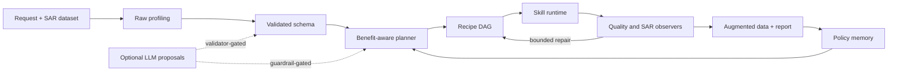

# SAGA

**SAGA: A Task-Driven and Quality-Assured Agent Framework for SAR Data Generation**

[](https://github.com/wxt117/SAGA/actions/workflows/ci.yml)
[](LICENSE)
[](pyproject.toml)

SAGA is a schema-grounded and evidence-aware framework for synthetic aperture radar (SAR) data generation and augmentation. It turns a natural-language request and a heterogeneous dataset into a validated dataset schema, a guarded augmentation plan, an executable recipe DAG, and evidence-qualified outputs.

> Research release, version 0.1.0. The deterministic core is included. Large model backends, checkpoints, and the private datasets used in the paper are not redistributed.

## Why SAGA

SAR augmentation is not just an image-generation problem. A useful workflow must understand dataset-specific metadata, choose a feasible method for the task and hardware budget, preserve SAR semantics, and distinguish plausible images from demonstrated downstream benefit. SAGA makes those decisions explicit and auditable.



The key design rule is that an LLM may propose intent, schema, or plans, but deterministic code validates those proposals before execution.

## Included

- Progressive dataset profiling and schema grounding for heterogeneous SAR layouts.
- Intent recognition, skill compatibility checks, benefit-cost-risk ranking, and recipe generation.
- Deterministic execution with provenance and standardized skill reports.
- Traditional SAR augmentation and target-background composition that run locally.
- Quality, distribution, SAR-artifact, duplicate, and leakage observers.
- Bounded repair, evidence-level qualification, and policy memory.
- Wrappers for LoRA, GeoDiff-SAR, GAN, style transfer, Gaussian splatting, RaySAR, background generation, and downstream classification evaluation.

The wrappers describe and orchestrate optional external backends. Those projects and their weights are not vendored into this repository; configure local paths before real execution.

## Installation

Clone the repository and create or update the required `sd3` Conda environment:

```bash
git clone https://github.com/wxt117/SAGA.git
cd SAGA
conda env update -n sd3 -f environment.yml
conda run -n sd3 python -m saga --help
```

For development and experiment plots:

```bash
conda run -n sd3 python -m pip install -e ".[dev,plots]"
```

## Quickstart

The following CPU-only workflow creates a tiny synthetic fixture, profiles it, applies deterministic SAR-aware augmentation, and evaluates the result. No API key, private dataset, or GPU is required.

```bash
conda run -n sd3 python examples/make_demo_dataset.py

conda run -n sd3 python -m saga profile-dataset \
  --root examples/demo_dataset \
  --request "augment the vehicle SAR chips while preserving polarization metadata" \
  --output outputs/demo/profile

conda run -n sd3 python -m saga bridge-format \
  --profile outputs/demo/profile \
  --output outputs/demo/profile

conda run -n sd3 python -m saga traditional-augment \
  --dataset examples/demo_dataset \
  --output outputs/demo/augmentation \
  --target-count 12 \
  --run

conda run -n sd3 python -m saga evaluate-output \
  --input outputs/demo/augmentation/generated_images \
  --output outputs/demo/evaluation \
  --expected-count 12
```

SAGA defaults expensive skills and the end-to-end agent to dry-run. Use `--run` only after reviewing the generated recipe and backend paths.

## Agent Workflow

A deterministic end-to-end dry run can be launched with:

```bash
conda run -n sd3 python -m saga agent-run \
  --request "use traditional SAR augmentation on examples/demo_dataset and generate 12 samples" \
  --dataset-root examples/demo_dataset \
  --output outputs/demo/agent \
  --no-memory
```

Optional LLM-assisted intent and planning use an environment variable, never a committed key:

```bash
export DEEPSEEK_API_KEY="your-key"
conda run -n sd3 python -m saga agent-run \
  --request "profile my SAR dataset and propose a feasible augmentation recipe" \
  --dataset-root /path/to/dataset \
  --output outputs/llm-plan \
  --llm-config configs/llm/deepseek_v4pro.yaml \
  --use-llm-intent \
  --use-llm-planner
```

Do not place real credentials in YAML files.

## Repository Layout

```text
saga/          framework, skills, observers, executor, and CLI
configs/       example policies, dataset schemas, and backend adapters
experiments/   scripts corresponding to the paper experiments
tests/         unit and integration tests with generated fixtures
docs/          architecture, protocol, skills, and reproducibility notes
examples/      self-contained public demos
results/       paper-result notes and release-level summaries
```

## Paper Results

The controlled benchmark reported in the manuscript evaluates schema grounding, planning, execution, observer/repair behavior, downstream benefit, qualitative traceability, and ablations. In the 8-task downstream benchmark, Full SAGA reports an average score of 60.1, a matched gain of 7.4 percentage points over no augmentation, and a 1.0% invalid-sample rate. These aggregate metrics combine task-appropriate accuracy, macro-F1, or mAP and must not be interpreted as one homogeneous metric.

The paper's data-availability statement says that the underlying datasets are private. Accordingly, this repository does not claim full artifact reproducibility for private-data or checkpoint-dependent results. See [docs/reproducibility.md](docs/reproducibility.md) for the exact boundary.

## Optional Backends

Configuration files under `configs/skills/` contain example relative paths for the authors' local adapters. To use a backend, obtain its source and checkpoints under their respective licenses, then update the corresponding configuration. A dry run is the recommended first check:

```bash
conda run -n sd3 python -m saga diffusion-lora \
  --dataset /path/to/captioned-sar-data \
  --output outputs/lora-plan \
  --config configs/skills/diffusion_lora.yaml \
  --dry-run
```

The MIT license in this repository covers SAGA's original code only. External datasets, model weights, and third-party backends retain their own licenses and terms.

## Development

```bash
conda run -n sd3 python -m pytest
conda run -n sd3 python scripts/check_publication.py
```

The publication check rejects credential-like strings, absolute machine-local paths, and tracked files larger than 100 MB.

## Citation

The paper is currently represented by the submitted manuscript metadata. Update the entry below with the journal, DOI, year, volume, and pages after acceptance.

```bibtex
@article{wu_saga,
  title   = {SAGA: A Task-Driven and Quality-Assured Agent Framework for SAR Data Generation},
  author  = {Wu, Xuanting and Zhang, Fan and Ma, Fei and Guan, Ling and Ma, Guochun and Zhou, Yongsheng},
  note    = {Manuscript under review}
}
```

Machine-readable citation metadata are available in [CITATION.cff](CITATION.cff).

## License

SAGA is released under the [MIT License](LICENSE). Before publishing, the repository owner should confirm that MIT is compatible with institutional policy and every original-code contributor's consent.
